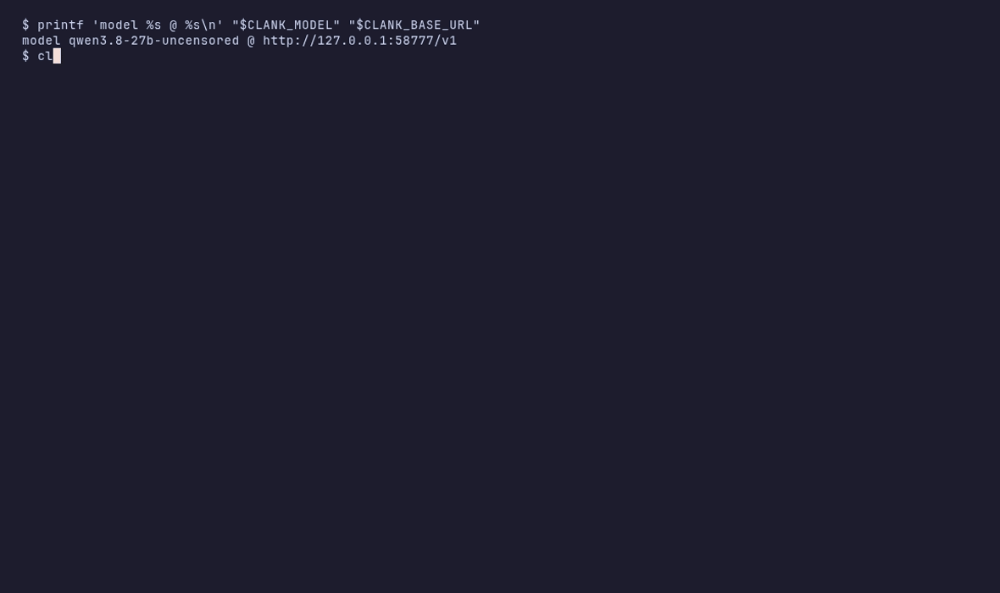

# clank — minimal unix-style inference harness

A Rust CLI that is one stage in a pipeline: prompt and context in on argv/stdin,
the answer out on stdout, diagnostics on stderr, a verdict in the exit code. It
speaks to any OpenAI-compatible endpoint — built against llama.cpp's server, since
verified against a remote gateway and an MLX one too.

```sh
cargo build --release
./target/release/clank [OPTIONS] [PROMPT...]
```



Recorded against a live server by `scripts/record-demo.sh`: the four read-only
observers, the pipe as context, `--each` mapping one prompt over three items, a
schema-constrained answer through `jq`, and what failure looks like — a legible
reason and `exit 1`.

- [CHEATSHEET.md](CHEATSHEET.md) — flags, one-liners, integrations
- [docs/use-cases.md](docs/use-cases.md) — the job families, each with its gate and its price
- [PROTOCOL.md](PROTOCOL.md) — the contract: invariants, request sequence, context doctrine, event set, exit codes
- [docs/macbook-omlx-local-inference.md](docs/macbook-omlx-local-inference.md) — it running against local models on a 16 GB Mac: which model per job, the programming workflow as one-liners, what does not work

## Install

Not on crates.io — the crate named `clank` there is an unrelated project — and no
prebuilt binaries. One binary, six direct dependencies, and nothing system-provided
beyond a C compiler (`ring`, for TLS; no OpenSSL to find):

```sh
cargo install --locked --git https://github.com/makefunstuff/clank   # -> ~/.cargo/bin/clank
```

That directory is on `PATH` if you have installed anything with cargo before; if
`clank: command not found` is your first result, it is not. `--locked` holds the
dependency graph to the committed `Cargo.lock`; `--rev <sha>` pins clank itself,
which is what you want when wiring it into something else.

From a checkout instead, if you would rather read it first — `src/` is 1.9k lines:

```sh
git clone https://github.com/makefunstuff/clank && cd clank
cargo build --release     # -> ./target/release/clank
cargo test                # 24 tests, no model and no network: a stub SSE server
```

At run time it needs an OpenAI-compatible endpoint that does tool calling.
llama.cpp's `llama-server` is what it was built against, and the only piece here
that wants a GPU. Point it at one and check the round trip:

```sh
export CLANK_BASE_URL=http://127.0.0.1:8080/v1
export CLANK_MODEL=$(curl -s "$CLANK_BASE_URL/models" | jq -r '.data[0].id')
clank -m 'reply with exactly: pong'    # -> pong, exit 0
```

The built-in defaults (`http://127.0.0.1:40583/v1`,
`qwen3.8-27b-gsq-rco-iq3xxs`) are one machine's. Those two variables plus the flags
in [Configuration](#configuration) are the whole configuration — no config file, no
state on disk — and a model the server does not serve is the usual first failure. It
is not silent: the server's reason goes to stderr and the exit code is 1.

Container instead of a toolchain: [In a container](#in-a-container).

## Why not an agent framework

A persistent agent harness is a large program whose tool surface you trust by
default, because you will not read it. When that surface can write files and run
commands with your permissions, what you are trusting is the whole machine.

The surface here is stdin, stdout, stderr and an exit code. No daemon, no session
store, no memory you did not hand over. Everything an "agent" does internally is a
pipeline step you can read — `rg`, `git diff`, `jq`, `sed`, `xargs -P`.

So the input is visible: the context is exactly what you piped. The cost is
visible: one call is one call, with no loop re-sending a growing history. And the
write stays yours — clank observes and proposes, a gate decides, you apply. In a
container with the tree mounted read-only that boundary belongs to the kernel
rather than to clank's promises; it bounds what the model can *write*, not what it
can *reach*.

What it does not give you: memory across sessions, retrieval you did not construct,
or a loop that edits your code while you are away. Those are what a harness is for.

## What it is for

Ask a model about text you already have, and get back something your shell can act on:

```sh
rg -n -C3 "userData" src/ | clank --thinking off -m "what does this do?"
git diff | clank --thinking off --max-tokens 400 -m "review this diff, one line per issue"
rg -l "TODO" src/ | clank --each --thinking off -m "one-line summary"
clank --json-schema @schema.json -m "extract the findings" | jq -er .
clank --jsonl -m "summarize" | clank -m "what did you say?"
clank --system @prompts/review-sh.md -c script.sh -m "review the script"
```

## Unix contract

- **stdout is data.** The answer, framed `--each` answers, or `--jsonl` events —
  `run`, `item`, `tool_call`, `tool_result`, `assistant`, `error` — and nothing
  else. A `--jsonl` stream opens with a `run` event naming the model, the endpoint
  and the argv (API keys redacted), so a trace says what produced it.
- **stderr is diagnostics.** Tool breadcrumbs, reasoning under `--show-thinking`,
  errors. Token accounting stays in the server's log, where it already lives.
- **exit codes.** `0` ok; `1` failure — model, server, IO, a truncated answer, an
  empty answer, or any failed `--each` item; `2` usage. Truncation and emptiness
  are failures, not results: a stage that reports a success it cannot back is worse
  than one that fails.
- **prompt** comes from `-m TEXT`, positional text, piped stdin (stdin is the prompt
  only when no other prompt is given), or one line from a TTY.
- **context** is piped stdin, which becomes a context node when a prompt is also
  given: a clank trace renders as a transcript, anything else as text. `-c FILE`
  (repeatable) loads a saved context — JSON tree, text, or a trace. `-c` nodes come
  first, then the pipe; a pipe that reaches the process is never dropped.
- **tools** are offered only when nothing was piped — no stdin, no `-c`, no `--each`
  items — because with no evidence to hand over, the only honest answer about your
  workspace is one that looked at it. Every lookup lands on stderr. When evidence
  was supplied, that is the evidence and nothing else. `--no-tools` forces the blind
  case, and the prompt then forbids citing what it never saw.
- **no colour**, plain text on both channels. `--quiet` drops the breadcrumbs.
- **SIGPIPE restored** (Rust sets SIG_IGN by default), so `clank … | head` dies
  cleanly; output is line-buffered and flushed per delta.

## Context tree

A context file is plain text (one text node) or a JSON tree:

```json
[
  { "text": "raw text node" },
  { "file": "path/relative/to/cwd" },
  { "children": [ { "file": "a.md" }, { "text": "more" } ] }
]
```

File leaves are read at render time and emitted as `─── path ───` plus content. A
`-c` file is validated strictly, because a file is configuration someone wrote on
purpose; the pipe parses leniently, because it is evidence.

## Map (`--each`)

One prompt over every item on stdin, serially, one conversation per item. The items
are the context, so the prompt has to come from `-m`/positional.

```sh
rg -l "TODO" src/ | clank --each -m "one-line summary of this file"
find src -name '*.rs' -print0 | clank --each -0 -m "any overflow risk here?"
```

Text mode frames each answer with the item it belongs to, so stdout maps back to
stdin (`awk '/^─── item /{…}'` splits it):

```
─── item 1/2 ───
src/main.rs: parses args and drives the loop.

─── item 2/2 ───
src/tools.rs: four read-only observers.
```

`--jsonl` adds `i` (1-based) and `of` to every event and emits one `item` event
carrying the input before the work starts, so a consumer never has to guess. A
failed item is an `error` event and a stderr line, and it does not stop the run —
fifty items should not be thrown away because the third one timed out. The exit
code is `1` if any item failed. An empty item list is not a failure.

Everything except the trailing item block is byte-identical from item to item,
which is what lets the server reuse the prompt prefix. There is no parallelism
inside clank: `-P` belongs to `xargs`.

## Keeping it fast

The model is the constraint — clank's own share is 1 ms of startup — so the lever
is the tokens you pay for:

| rule | measured |
|---|---|
| `--thinking off` for mechanical work | 1.35 s → 0.25 s |
| keep the prompt head stable, vary the tail | 10.4 s → 0.21 s (cached prefix) |
| stop reading when you have enough (`clank … \| head -1`) | 7.1 s → 0.6 s |
| one call holding many items beats many small calls | 1.5× on four items |

Per call: ≈0.25 s fixed, ≈0.02 s per output token, prompt tokens at 1.3 ms cold and
0.02 ms cached. `docs/research-harness-constraints.md` §5.2 has the raw numbers and
§5.3 the comparison against headless pi.

## Tools (`--tools`, opt-in)

| tool | description |
|---|---|
| `read_file(path, start_line?, end_line?)` | numbered file content |
| `list_dir(path)` | directory entries (name, type, size) |
| `search(pattern, path?, ignore_case?, context_lines?, glob?)` | regex search, `file:line: text` |
| `stat(path)` | file/directory metadata |

A tool call is the wrong way to feed a stage: it is a worse `rg` with an input
nobody can see in the pipeline. The composable form of a lookup is a pipe, and the
composable form of looking twice is a second stage. Reach for `--tools` when one
lookup inside one stage is genuinely cheaper than a second stage.

`search` is deliberately weaker than ripgrep: line-based, single-line patterns,
capped at 500 matches and 4 MB per file, skipping binaries, symlinks and `.git`.
Flags: `ignore_case`, `context_lines` (0–10), `glob`. For anything heavier, compose
with the real tool.

Tool errors go back to the model as data. A bad context file or a server error is a
process failure.

## Configuration

Flags override `$CLANK_*` environment variables, which override built-in defaults:

| flag | env | default |
|---|---|---|
| `-m` / `--message` / positional | — | — |
| `-c` / `--context` | — | — |
| `--each` | — | false |
| `-0` / `--null` | — | false |
| `--tools` | — | on only when nothing was piped |
| `--no-tools` | — | false |
| `--thinking` | — | server default |
| `--show-thinking` | — | false |
| `--model` | `CLANK_MODEL` | `qwen3.8-27b-gsq-rco-iq3xxs` |
| `--base-url` | `CLANK_BASE_URL` | `http://127.0.0.1:40583/v1` |
| `--api-key` | `CLANK_API_KEY` | none |
| `--timeout` | `CLANK_TIMEOUT` | 600 s per request |
| `--max-tokens` | — | 8192 |
| `--json-schema` | — | none |
| `--system` | `CLANK_SYSTEM` | — |
| `--list-tools` | — | — |
| `--max-rounds` | — | 12 tool rounds per prompt (with `--tools`) |
| `--jsonl`, `-q`/`--quiet`, `-h`/`--help` | — | — |

## Demo

`demo.sh` is the reference pipeline. Stage 1 writes a script that renders
`fixtures/notes.md` as HTML; stage 2 critiques it against the fixture and the
shell's own measurements; stage 3 finalizes it under `--json-schema`; stage 4 has
the model propose a command that verifies the result. The fixture is piped at every
stage, so no stage asks the model to read the filesystem for itself; every stage is
gated, and a non-zero exit, an answer that is not the expected JSON, or a script
that fails `bash -n` stops the run. One `--jsonl` trace per stage lands in
`local/demo-traces/`.

Its first version did print "passed" after producing a broken artifact. That is what
the gates are for.

## In a container

`Dockerfile` builds a 32 MB image holding the binary and nothing else.

```sh
docker build -t clank .

git log -1 --stat | docker run --rm -i --network=host \
  -v "$PWD":/w:ro -w /w \
  -e CLANK_BASE_URL=http://127.0.0.1:4000/v1 \
  -e CLANK_MODEL=deepseek/deepseek-v4-flash \
  clank --thinking off -m "The context is git log --stat. One line: what changed and the risk it carries."
```

Verified 2026-09-19 with the repo mounted read-only; it answered:

> `docs/use-cases.md` gained §8 (87 lines) and `PROTOCOL.md` one line, … the risk is
> that the units are unverified in-place — only hand-tested once, where a truncated
> run left a `run` event with no `assistant`.

With nothing piped, the read-only observers look around inside the container, each
lookup on stderr:

```
> search context_lines=0 glob=* ignore_case=true path=. pattern=exit.?code|EXIT_|exit\(2\)|return 2
< search ok (3019 B)
> list_dir path=.
< list_dir ok (326 B)
```

and the answer cited `src/main.rs:10`.

Four details are not optional. `-i` is what lets the pipe reach it. `--network=host`
is what makes a model on localhost reachable, and it is also the limit of the
sandbox. `:ro` is not decoration: mounted read-only, `touch /w/pwned` returns
`Read-only file system`. And not alpine — clank is glibc-dynamic, and musl has no
loader for it; `ubuntu:24.04` and `debian:stable-slim` both work.

## Verified

* Endpoints: qwen 3.8 27b (Qwen3.8-27B GSQ-RCO IQ3_XXS) on `:40583` and qwen 3.6
  35B-A3B (Qwen3.6-35B-A3B-UD-Q5_K_S) on `:37313`, both via the OpenAI-compatible
  endpoint with SSE streaming and tool calling; plus a remote gateway on `:4000`.
  On 2026-09-19, oMLX 0.7.0 on `:8000` serving MLX models on a 16 GB M1 Pro:
  `Qwen3.5-9B-MLX-4bit`, `MiniCPM5-2B-MLX-8bit` and `gemma-4-E4B-it-MLX-4bit` all
  answer, stream and expose reasoning; the fourth listed model,
  `Bonsai-2-27B-CRACK-1.75bit-JANG`, loads on no request at all — the runtime
  answers 409 and clank prints the server's reason verbatim, 402 parameter names
  included. Details and raw output in `docs/macbook-omlx-local-inference.md`.
* **A top-level `json_schema` is the endpoint's grammar to enforce, not clank's.**
  Against the local endpoints it held: asked to reply `beta` under a schema whose
  only legal value was `alpha`, clank printed `{"word":"alpha"}`. Through the
  gateway (2026-09-19) it did not: a fenced block came back with the wrong key, and
  clank exited 1 with *final output is not valid JSON; --json-schema requested*.
  The contract held either way — a violation is a failure, not a result — but assume
  the grammar holds only where it has been measured. A schema and tools never share
  a request; with `--tools` the rounds run unconstrained and one final request
  carries the schema. This server build rejects the pair (400, by curl probe).
  Measured per model on oMLX the same day: `Qwen3.5-9B-MLX-4bit` returns bare,
  valid JSON; `gemma-4-E4B-it-MLX-4bit` wraps it in a Markdown fence and
  `MiniCPM5-2B-MLX-8bit` answers in prose, both of them `exit 1`. One schema,
  three models, two of them ignoring it — which model carries the grammar is a
  property to measure, not to assume.
* The tools fallback exists because of a measured failure. With nothing piped and no
  tools, `clank -m "which file defines the transcript rendering, and what is the
  output cap? cite file:line"` answered *"`src/renderer.ts`, cap 8000 at
  `src/renderer.ts:14`"* — a file that does not exist, in the citation format of a
  real answer, exit 0. The same question with the tools offered answered
  `src/context.rs:68` and cap `400` at `src/context.rs:136`, with the test that
  asserts it. The fallback is still a fallback: on oMLX the 2B reproduced that
  same invented citation *with* the tools on — two lookups in the stderr
  breadcrumbs, then `src/renderer.ts:14` again. What survives a model that
  fabricates is the exit code and the observable channel, not the feature.
* `--thinking off` arrives as `chat_template_kwargs.enable_thinking=false` and a
  level as `reasoning_effort`, with no field at all by default and exit 2 for an
  unknown level. It removes reasoning on both local endpoints; an effort level is
  honoured by one and silently ignored by the other. Reasoning reaches stderr only
  under `--show-thinking`, and stdout stays the answer alone.
* `cargo test` drives the real binary against a stub SSE server that records every
  request body, and asserts what this README and PROTOCOL.md claim: the default is
  one request with no tools; a schema and tools never share a request; the schema'd
  round carries the tool results it read; piped evidence is still context when `-c`
  is used; `--each` frames one answer per item (byte-exact) and shares the prompt
  prefix; a failed item is an `error` event plus exit 1 while the others are still
  answered; an empty item list exits 0; a truncated or empty answer exits 1 rather
  than reporting success; the `run` event's argv has any `--api-key` redacted; a
  trace with a `run` header still reads back as context.
* `demo.sh` ran end to end on 2026-09-17 against `:37313`: four stages, 61 s, all
  gates passed. Its first run found a real defect — an ungated stage wrote a broken
  candidate and the script still announced success. On 2026-09-19 against oMLX it
  passed on `Qwen3.5-9B-MLX-4bit` in 35 s, and stopped at a different gate on each
  of the other two: gemma on the fenced schema at stage 3, the 2B on a truncated
  answer at stage 1.
* Live: tree context renders text, file and nested nodes in document order;
  `--jsonl` parses with `jq`; repeatable `-c` concatenates files in order (checked
  through the `CLANK_DEBUG` request dump); `--system` appends the directive to the
  system prompt; `clank --jsonl | clank` and `clank -c trace.jsonl` render the prior
  run as a tagged transcript; `clank … | head -1` exits 0; `--list-tools` prints the
  four definitions without a model call; no prompt with empty stdin exits 2, an
  unreadable context file exits 1, `--help` exits 0.
* `--tools` is no longer unexercised: the oMLX runs sent it through the round
  loop end to end, with the lookups on stderr as promised. Still unexercised
  against a live model: the schema-after-tools sequence — the wire tests cover
  that request and output contract only. TTY-with-no-prompt reads one line, in code; it is not exercisable headless.

## Provenance

Code and docs are largely LLM-written and then read and curated. The commits are the
record of what changed, when, and each of the claims under *Verified* was run.
